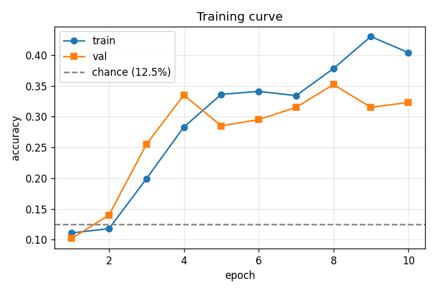
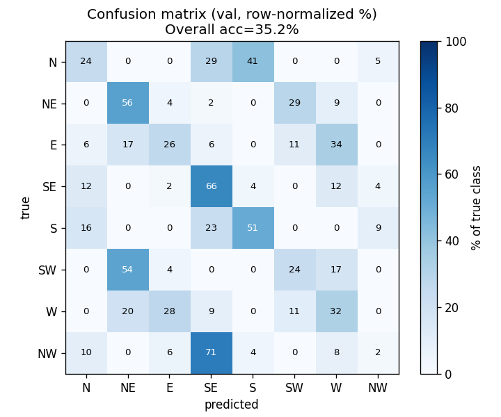
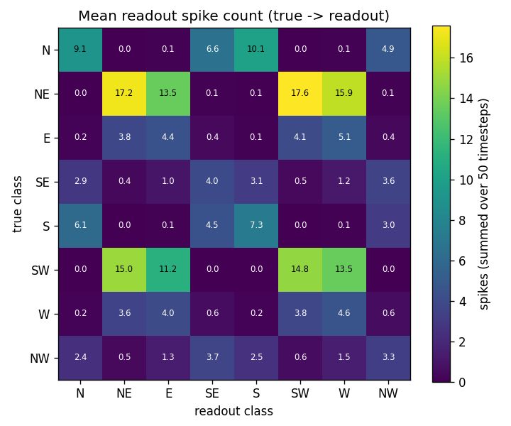

# Heading classifier v1 — first pass

**Date:** 2026-04-16
**Commit at training:** `2ad486a`
**Artifacts:** `checkpoints/best_heading.pt`, figures in this directory
**Status:** underperforming — needs iteration before chip deployment

## Goal

Train a small SNN in sinabs that classifies 8-way heading (N/NE/E/SE/S/SW/W/NW)
from 250 ms DVS clips, small enough to deploy to Speck2fDevKit via
`sinabs.backend.dynapcnn.DynapcnnNetwork`. This run validates the full offline
pipeline (synthetic data → train → diagnose); chip upload is still pending.

## Setup

### Data (`scripts/gen_heading_dataset.py`)

Procedural synthetic DVS: random shapes + noise on a padded canvas, translated
along the heading vector over 50 timesteps (= 250 ms at 5 ms/step). Per-frame
intensity deltas are thresholded into ON / OFF polarity spikes.

| Parameter | Value |
|---|---|
| frame size | 128 × 128 |
| timesteps per clip | 50 |
| pixels per step | 0.8 – 2.0 (random) |
| diff threshold | 0.05 |
| shapes per scene | 4 – 12 |
| noise std | 0.05 |
| train / val clips | 2000 / 400 |

### Model (`src/heading_net/model.py`)

5-layer SNN, 21,526 parameters, dynapcnn-compatible (bias-free conv, IAFSqueeze
neurons, no BN/dropout in backbone).

```
Conv 3×3 s=2  2→ 8  + IAF   128 → 64
Conv 3×3 s=2  8→16  + IAF    64 → 32
Conv 3×3 s=2 16→16  + IAF    32 → 16
Conv 3×3 s=2 16→32  + IAF    16 →  8
Conv 3×3 s=2 32→32  + IAF     8 →  4
Flatten → Linear 512 → 8 + IAF  (readout)
```

### Training

| Parameter | Value |
|---|---|
| optimizer | Adam |
| LR | 1e-3 (constant) |
| batch size | 16 |
| epochs | 10 |
| device | Apple M-series MPS |
| loss | cross-entropy on time-integrated readout spikes |
| epoch wall-time | ~34 s |

## Results

### Training curve



| epoch | train_loss | train_acc | val_loss | val_acc |
|:-:|:-:|:-:|:-:|:-:|
| 1 | 2.0794 | 0.111 | 2.0794 | 0.102 |
| 2 | 2.1052 | 0.118 | 1.9984 | 0.140 |
| 3 | 2.0264 | 0.199 | 1.7409 | 0.255 |
| 4 | 1.8404 | 0.283 | 1.8252 | 0.335 |
| 5 | 1.6619 | 0.336 | 1.8976 | 0.285 |
| 6 | 1.6017 | 0.341 | 1.7190 | 0.295 |
| 7 | 1.6076 | 0.334 | 1.6213 | 0.315 |
| 8 | 1.4633 | 0.378 | 1.6013 | **0.352** |
| 9 | 1.3744 | 0.430 | 1.5503 | 0.315 |
| 10 | 1.4057 | 0.404 | 1.7460 | 0.323 |

- **Best val acc:** 35.2 % at epoch 8 (chance = 12.5 %, target ≥ 80 %).
- Train–val gap widens from epoch 7 onward → early overfitting / plateau.
- Loss is still trending down on train; the model has not converged but has
  stopped generalizing.

### Confusion matrix



Row-normalized, row = true, column = predicted, values in %.

|true\pred| N | NE | E | SE | S | SW | W | NW |
|:-:|:-:|:-:|:-:|:-:|:-:|:-:|:-:|:-:|
| **N**  | 24.4 |  0.0 |  0.0 | 29.3 | **41.5** |  0.0 |  0.0 |  4.9 |
| **NE** |  0.0 | 55.6 |  4.4 |  2.2 |  0.0 | **28.9** |  8.9 |  0.0 |
| **E**  |  5.7 | 17.0 | 26.4 |  5.7 |  0.0 | 11.3 | **34.0** |  0.0 |
| **SE** | 12.5 |  0.0 |  1.8 | **66.1** |  3.6 |  0.0 | 12.5 |  3.6 |
| **S**  | 16.3 |  0.0 |  0.0 | 23.3 | **51.2** |  0.0 |  0.0 |  9.3 |
| **SW** |  0.0 | **54.3** |  4.3 |  0.0 |  0.0 | 23.9 | 17.4 |  0.0 |
| **W**  |  0.0 | 20.0 | **27.7** |  9.2 |  0.0 | 10.8 | 32.3 |  0.0 |
| **NW** |  9.8 |  0.0 |  5.9 | **70.6** |  3.9 |  0.0 |  7.8 |  2.0 |

### Readout firing rate



Mean spike count at the readout layer over 50 timesteps, conditioned on the
true class. Low absolute counts (2–5 spikes/class) are diagnostic in
themselves.

## Diagnosis

The confusion matrix exhibits a **clear axis-vs-sign failure mode**. The model
reliably identifies the *axis* of motion (vertical / horizontal / one of the
two diagonals) but frequently picks the *wrong sign* along that axis:

- N ↔ S: 41.5 % of N predicted as S; 23.3 % of S predicted as SE (adjacent)
- NE ↔ SW: 54.3 % of SW predicted as NE; 28.9 % of NE predicted as SW
- E ↔ W: 34.0 % of E predicted as W; 27.7 % of W predicted as E
- NW ↔ SE: 70.6 % of NW predicted as SE; 29.3 % of N predicted as SE

The direction *sign* is encoded in the relative spatial offset between ON and
OFF event distributions (leading edge vs trailing edge of a moving feature).
Two architectural / data properties make this signal hard to recover:

1. **Very sparse readout firing** — per-class spike counts average 2 – 5 over
   50 timesteps (≈ 0.05 spikes/step), which starves the cross-entropy gradient.
   Primary cause: `diff_threshold = 0.05` filters out most pixel changes in the
   synthetic scenes (moderate contrast, 0.05 noise std).
2. **Aggressive early striding** — stride-2 in every one of five conv layers
   destroys the fine spatial offset between ON and OFF distributions before the
   readout can compare them. By the time spikes reach the 4×4 feature map, the
   sign information has been pooled away.

## Recommended fixes (ranked by expected impact ÷ cost)

### 1. Lower `diff_threshold` 0.05 → 0.02 *(minutes)*

Expect ~3 – 5× more spikes per clip; gives the IAF chain a stronger signal to
propagate. Regenerate data at the new threshold, retrain.

### 2. 25 epochs + cosine LR schedule *(~15 min wall-time)*

Train loss was still decreasing at epoch 10. Pair longer training with a
cosine LR decay to stabilize the late-epoch val plateau.

### 3. Keep spatial resolution in early layers *(architecture change)*

Change the first two layers to stride-1 (+ SumPool2d afterwards if needed) so
the network can still compare ON / OFF distributions at higher resolution
before collapsing to 4×4. Costs more multiply-accumulates but still fits
Speck's 9 cores comfortably.

### 4. Fallback: drop to 4 classes *(data regen + relabel)*

If fixes 1–3 don't push val acc above ~60 %, simplify to cardinal-only (N/E/S/W).
Opposite-direction distinction is the dominant error mode; removing diagonals
halves the confusion set. We can re-add diagonals once the 4-class baseline works.

## Plan for v2

1. Apply fix #1 (threshold 0.02) + fix #2 (25 epochs, cosine LR).
2. If val acc ≥ 75 %, proceed to `scripts/deploy_and_run.py` for chip upload
   and log the deployment in `experiments/<date>_heading_v2_chip/`.
3. If val acc 50 – 75 %, add fix #3.
4. If still < 50 %, apply fix #4 and rerun.

## Files referenced

- Training script: `scripts/train_heading.py`
- Eval script: `scripts/eval_confusion.py`
- Figure script: `scripts/plot_diagnostics.py`
- Checkpoint: `checkpoints/best_heading.pt` (gitignored)
- Config: `src/heading_net/config.py`
- Model: `src/heading_net/model.py`
